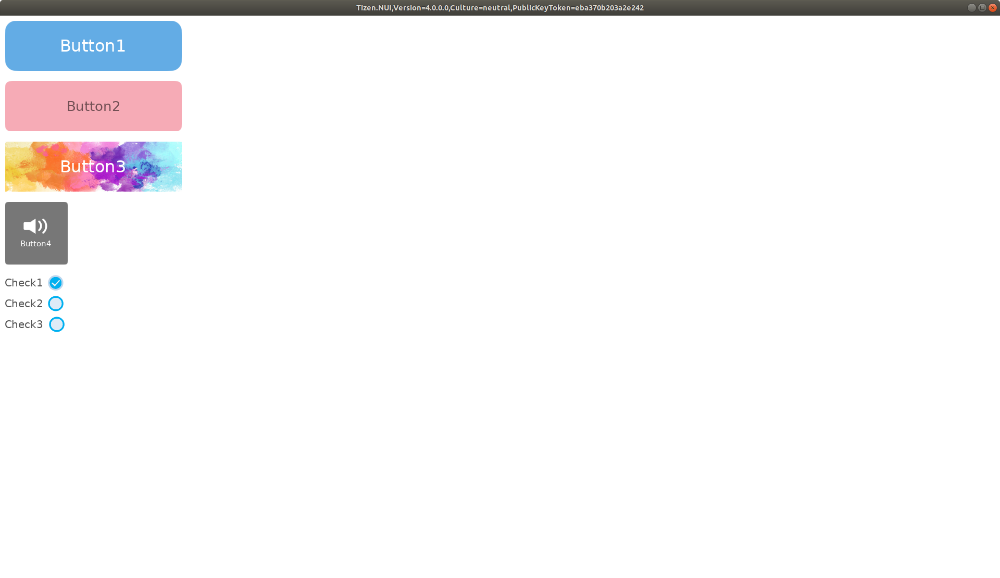

# Style tutorial

NUI provides style classes which can decorate NUI components. Each component has correspoding style class, for example:
* [ViewStyle](https://docs.tizen.org/application/dotnet/api/TizenFX/API9/api/Tizen.NUI.BaseComponents.ViewStyle.html) for [View](https://docs.tizen.org/application/dotnet/api/TizenFX/API9/api/Tizen.NUI.BaseComponents.View.html)
* [ButtonStyle](https://docs.tizen.org/application/dotnet/api/TizenFX/API9/api/Tizen.NUI.Components.ButtonStyle.html) for [Button](https://docs.tizen.org/application/dotnet/api/TizenFX/API9/api/Tizen.NUI.Components.Button.html)/[CheckBox](https://docs.tizen.org/application/dotnet/api/TizenFX/API9/api/Tizen.NUI.Components.CheckBox.html)/[RadioButton](https://docs.tizen.org/application/dotnet/api/TizenFX/API9/api/Tizen.NUI.Components.RadioButton.html)/[Switch](https://docs.tizen.org/application/dotnet/api/TizenFX/API9/api/Tizen.NUI.Components.Switch.html)
* [SliderStyle](https://docs.tizen.org/application/dotnet/api/TizenFX/API9/api/Tizen.NUI.Components.SliderStyle.html) for [Slider](https://docs.tizen.org/application/dotnet/api/TizenFX/API9/api/Tizen.NUI.Components.Slider.html)

This example shows how to define styles in XAML and how to apply them to the components.  
From the top of the screen:
* Button style with custom background color.
* Button style with custom text color.
* Button style with custom background image.
* Button style with custom icon.
* Checkbox style with custom check images.

